<h1>Hi, I'm Wen Zhao 👋</h1>

## 🧑‍💻 About Me

Currently pursuing my Master's degree while bridging the gap between theory and implementation. My interests:

- 🤖 LLM Post-training (RLHF / PPO / GRPO)  
- 🧠 Reinforcement Learning for decision systems  
- 🔎 Retrieval-Augmented Generation (RAG)  
- 🛡️ Reliability / safety / stability  

## 🛠 Skills

 

## 📫 Contacts

